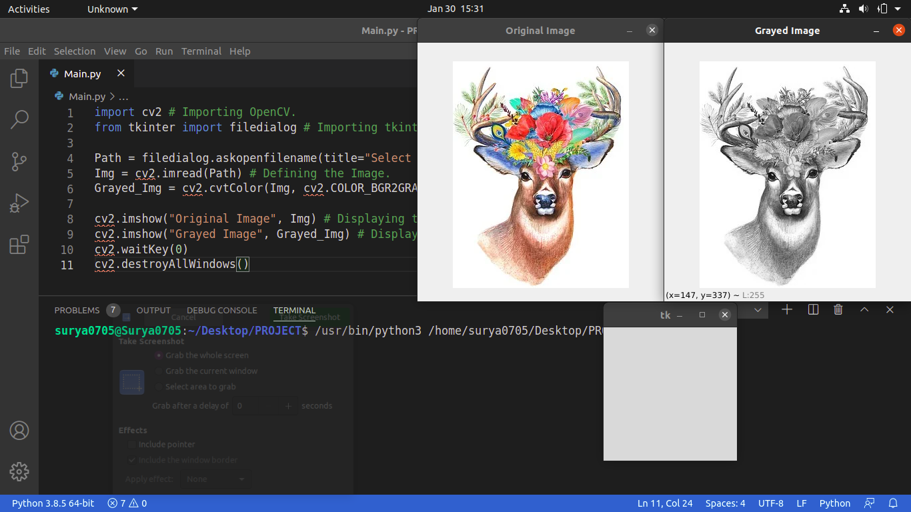

# Colored_to_Grayscale
This Python Program converts a Colorful image to a Grayscale one. It uses OpenCV library for this. To install this Module just type:
```
pip install opencv-python
```
Or if you are in Linux(Ubuntu 20.04 LTS which I am using) then use:
```
pip3 install opencv-python
```
Or install according to your OS. After installation just run the Main.py file and select the Image you want to convert to Grayscale and it will display the Grayed Image. Below is my Code Screenshot:


Hope that you liked it.
